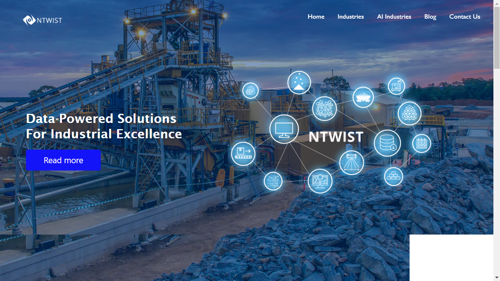
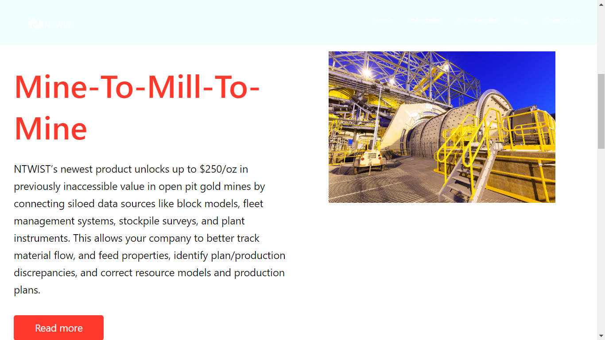
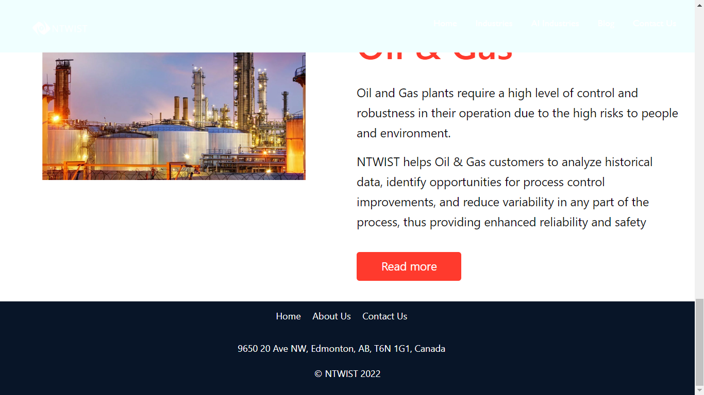

 #  Clone ntwist.com Homepage in React.js.

 This project involves creating a clone of the ntwist.com homepage using React.js. Follow these steps to get started:

# Prerequisites
Before you begin, make sure you have the following installed:

- Node.js and npm: You can download and install them from nodejs.org.

# Installation
1. Clone this repository to your local machine:
```
git clone https://github.com/shabbiryahya/Finmee-Technologies-PvtLtd-NTTWIST.git  ntwist

```

```
cd ntwist
```

2. Clone this repository to your local machine:
```
npm install

```
## Development
1. Start the development server:
```
npm start

```

2. Open your browser and navigate to http://localhost:3000 to see the development version of the ntwist.com homepage. You can now begin making changes to the code.

## Deployment to Netlify

1. Create a Netlify account if you don't have one: [Netlify Sign-Up](https://app.netlify.com/signup).

2. Install the Netlify CLI (Command Line Interface) globally:
```
npm install -g netlify-cli

```
3. Log in to your Netlify account:
```
netlify login

```
4. Build your React app for production:

```
npm run build

```

5. Deploy your app to Netlify:

```
netlify deploy
```

Follow the prompts in the terminal to set up the deployment, including selecting a site name, build command, and publishing directory. The build command should be npm run build, and the publish directory should be build.

6. Once the deployment is complete, your app will be accessible through a Netlify URL (e.g., https://your-site-name.netlify.app). You can configure custom domains and other settings in the Netlify dashboard.

## Customization
You can customize the clone by editing the React components and styles in the src directory. Make sure to test your changes locally using npm start before deploying to Netlify.

## Additional Resources
- React.js documentation: [React Documentation](https://reactjs.org/docs/getting-started.html)
- Netlify documentation: [Netlify Docs](https://docs.netlify.com/)

Happy coding! Feel free to reach out if you have any questions or need further assistance.
 ## Output: 
<video width="1080" height="240" controls>
  <source src="./src/components/assests/new_recording_-_10_6_2023,_11_07_05_am (720p).mp4" type="video/mp4">
  Your browser does not support the video tag.
</video>

 ## Header -
 

 ## Homepage -
 

## Footer -  
 


[Deployed Link](https://finmee-twist-homepage.netlify.app) &nbsp;
[Github Link](https://github.com/shabbiryahya/Finmee-Technologies-PvtLtd-NTTWIST)


